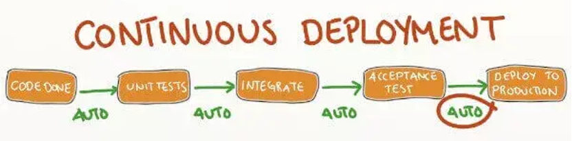
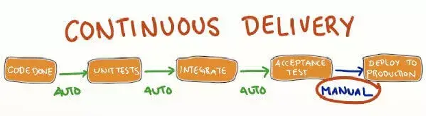
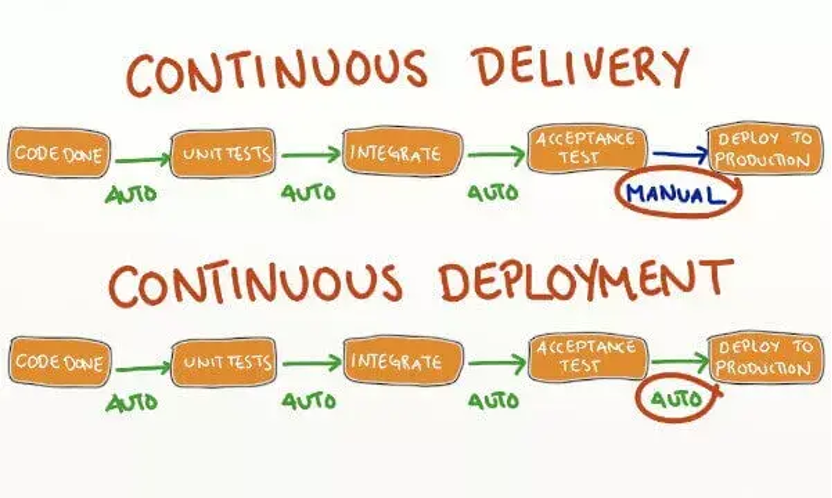
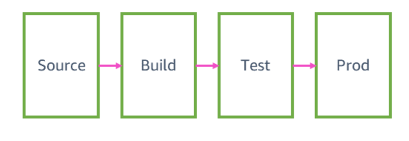
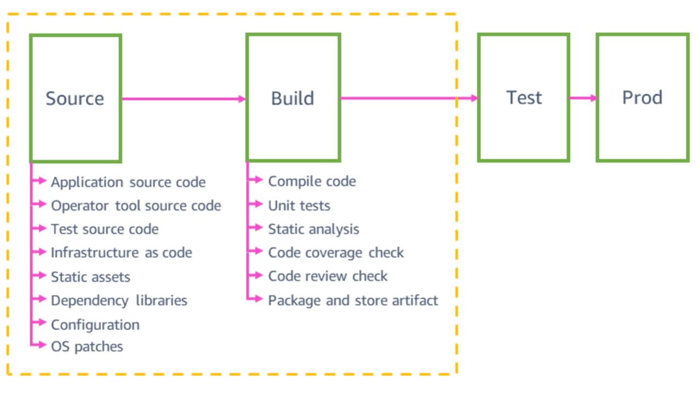
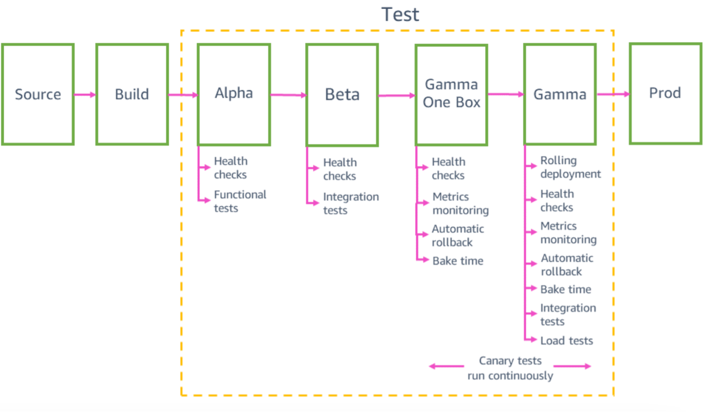
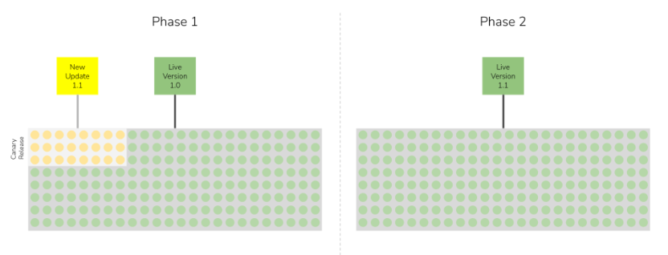

# Continuous Deployment
by Ju Bowei
---

## what is Continuous Deployment?
Continuous deployment is a strategy in software development

---

## Continuous Delivery

---
Difference Between Continuous Deployment and Continuous Delivery

---

## why?
1. Sustainable, rapidly iterative software processes are the dominant development paradigm today.
2. "Fast" has become a business competency.
3. Reduced deployment time and effort
4. Rapid feedback loop
5. Risk Mitigation
6. Competitive Advantages

---

### How
##### More frequent, faster deployment.
##### Newer features, using newer technologies
1. Version control systems
2. Continuous integration (CI)
3. Automated testing
4. Training and collaboration
5. Continuous feedback and improvement
6. production testing

---
## Amazon

---
### Four stages

---
#### Source & Build

---
#### Test

---
### Canary Releases

---
### How?
5. Monitoring and Indicators
6. Agile Teams
7. DevOps Culture

---

Thank You！
